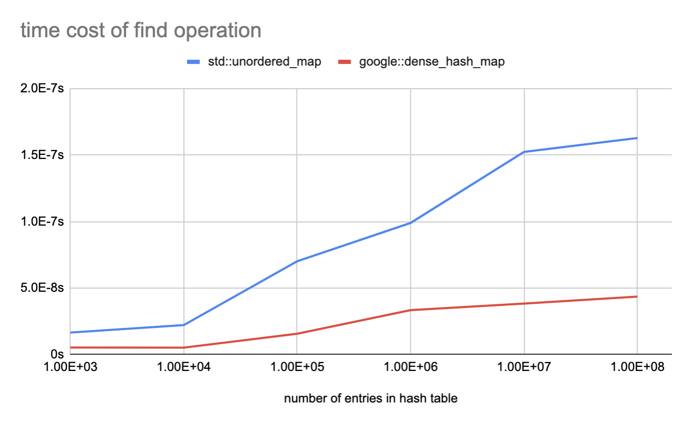

### how to run?
Install `sparsehash` from https://github.com/sparsehash/sparsehash. Then run the command.
```
mkdir build && cd build
cmake .. -DCMAKE_BUILD_TYPE=Release -DCMAKE_CXX_FLAGS="-O2 -Wall"
make
./hashmap_benchmark
```

### result


